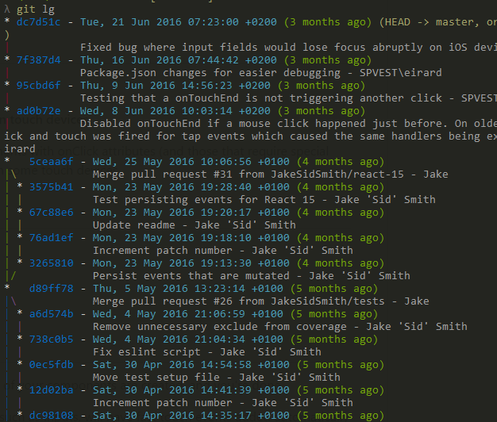

# Exercise 2 - Create aliases for typical git commands

With git you can create short hand aliases for git-commands. A typical alias for the `add` command is `a`. So instead of typing `git add` you can write `git a`.
This alias can e created by configuring git:
```
git config --global alias.a add
```

## In this exercise we will

- Learn how to create your own aliases for the most typical git commands
- Setup alias to set up an improved commit log printout in the terminal

## 2.1 - Create your own aliases

:pencil2: Create your own aliases for the most typical git commands

* status
* add
* commit
* push
* pull
* merge
* checkout

## 2.1.1 - A sidenote on .gitconfig

Global configurations to Git (commands done with `--global`) are saved to a global `.gitconfig` file on your computer. You can open this file in any text editor (windows users should avoid Notepad) and add/edit/delete the settings there at any time.  

On Windows this file will be located at `C:\Users\YOUR_USER\.gitconfig`  

On Linux or Mac this file will be located at `~\.gitconfig` (aka `\home\YOUR_USER\.gitconfig`).  

:grey_exclamation: Note that filenames starting with a dot means hidden in linux/mac so you might need to enable some setting to show dot-files in your OS window.  

:grey_exclamation: When using the command line on linux or mac you can use `ls -a` to list hidden files


## 2.2 - Create alias for improved commit log

A useful command is `git log` which will list the latest commits done. The default log is pretty basic though. A common tool for understanding git logs is a graph showing how branches and commits diverge and relate.

:bulb: When in git log mode, exit by typing ":q" as in vim

For example, in SourceTree, a log is shown like this:
<br/>


We can achieve this in the terminal as well by using an alias.

First, we need a bigger repo to play with to illustrate the point.

:pencil2: `git clone https://github.com/JakeSidSmith/react-fastclick` to your computer  
:pencil2: `git log` in the directory.

:pencil2: Add the following as aliases in your `.gitconfig`  

```
[alias]
	lg1 = log --graph --abbrev-commit --decorate --format=format:'%C(bold blue)%h%C(reset) - %C(bold green)(%ar)%C(reset) %C(white)%s%C(reset) %C(dim white)- %an%C(reset)%C(bold yellow)%d%C(reset)' --all
	lg2 = log --graph --abbrev-commit --decorate --format=format:'%C(bold blue)%h%C(reset) - %C(bold cyan)%aD%C(reset) %C(bold green)(%ar)%C(reset)%C(bold yellow)%d%C(reset)%n''          %C(white)%s%C(reset) %C(dim white)- %an%C(reset)' --all
	lg = !"git lg1"
```
_NOTE: You can skip the "[alias]" header in the snippet above if it exists in the file already, and just append the lines below to the existing section. There should only be one [alias] block in the file._

This adds 3 aliases. The `lg1` and `lg2` aliases is slightly different. Try them out. The `lg` alias basically just calls `lg1` as your default. Change it if you want to.

Using `git lg` (mapped to lg2 instead of lg1) I get the following. Note the commit history in the margin.


(:pencil2: You can delete the react-fastclick repository)

## 2.3 - Chaining commands in an alias

So far we've used Git's internal handling of aliases to map one git command into to another name. But we can also leverage another mechanism, which is to just pass the alias command on to the terminal itself. We do this by prefixing the command with `!`. The alias `add_status = !"git add --a && git status"` basically says that "just pass this command on to the terminal and let it execute it for me", thus bypassing Git's handling of the alias. This can be practical (but also error-prone) for doing more advanced aliases. Here's a few examples:

```
a = !"git add --a && git status"
co = !"git checkout && git status"
ac = !"git add --a && git commit -m \"$1\" && git lg2 -1 HEAD && :"
delbr = !"git branch -d \"$1\" && git push origin --delete \"$1\" && git status && :"
```
(As you can see, I find it really practical to always include a `git status` at the end :wink: )

Note that I end all commands _that accepts one or more parameters ($1, $2, etc)_ with a `&& :`. This is to short-circuit the command to avoid some strange behaviour from Git (discussed here https://stackoverflow.com/a/25915221). This is probably a Windows-only quirk which you may not need on Mac/Linux.

:pencil2: Make some more aliases using the chaining approach. What about a command that pulls master from origin then prints status? Or an alias that adds all files, then commits with a message, then pushes to origin, then logs the latest commit? Be creative, have fun!

### [Go to exercise 3](./exercise-3.md)
